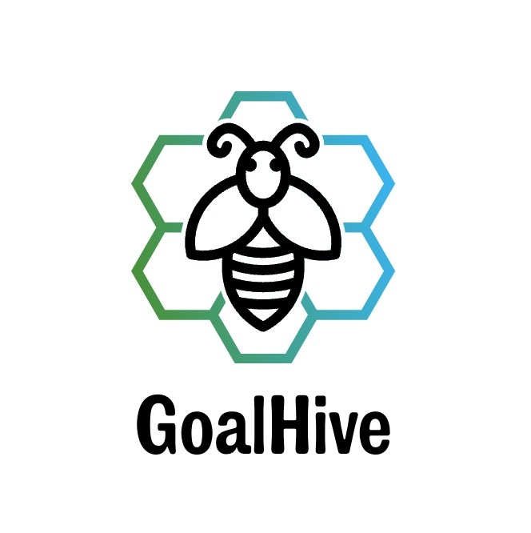

Welcome to the frontend repository of the GoalHive App! This frontend is built using React to provide an intuitive user interface for interacting with users and goals/interests.

Features 🐝
User will have access to the chat features of our app.
User will create a new profile to use our app to complete a goal with other users.
User will be able to finish a goal by a certain target date.
User will be able to make a positive lifetyle change using our app.

Technologies Used 💻
React: A JavaScript library for building user interfaces.
Axios: Promise-based HTTP client for making API requests.
React Router: Declarative routing for React applications.
Bootstrap: Front-end framework for designing responsive and mobile-first websites.
Socket-IO: A Chat feature to connect with users.
React-Native-Webview: This package allows you to render web content within your React Native app using a WebView component.
React-Router-Dom: This package provides routing capabilities for React applications. It enables you to handle navigation and rendering of different components based on the URL.
React-Scroll-To-Bottom:This package provides a scrollable container component that automatically scrolls to the bottom when new content is added.
React-Swipeable:  This package enables swipe gestures on components, allowing users to perform actions by swiping on the screen.
Socket.Io-Client: This package provides a client library for Socket.IO, which enables real-time bidirectional communication between the server and the client.
Swiper: This package is a powerful and customizable carousel component for React applications. It allows you to create slideshows and swipeable content.

Setup Instructions 📋
Clone this repository.
Install dependencies using npm install.
Ensure the backend server is running and accessible.
Update API endpoint URLs in the frontend codebase if necessary.
Start the development server with npm run dev.
Access the frontend at here

Usage 🚀
Browse our app to explore Goalhive's featurs
Create new profiles to share similar interests
Make a positive change with our app GoalHive.
Support each other to achieve similar goals.

Contributing 🤝
Shaka Livingstone
Rich Boyce
Tyrell K Oliver
Jackie Cheung

Feel free to explore the codebase and contribute enhancements or bug fixes to make the GoalHive  even better!
